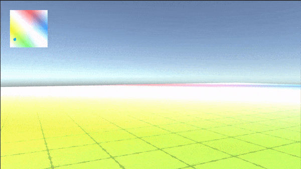
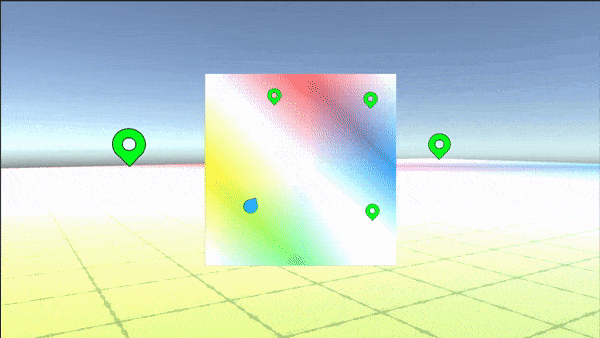

# MapMarkerTest
A system to view an overhead minimap during gameplay and place markers by clicking on the full-size map.

Both the minimap and the full size map use an overhead camera with particular layer masks
to show only the terrain and map icons. For non-flat terrain, this will work best with a
system to evaluate the height of the terrain at the chosen point.

Map markers in world space rotate to face the player and disappear when the player approaches.

